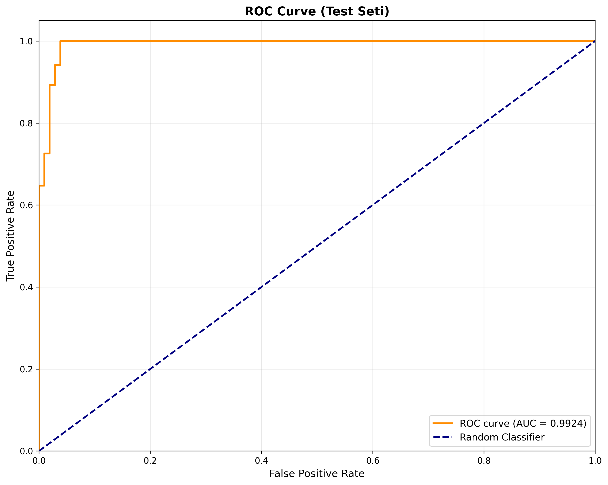

# Model Performance Report

## 1. Overview
**Version**: 1.0  
**Date**: [Tarih buraya gelecek]  
**Dataset Summary**: [Veri seti özeti buraya gelecek]

## 2. Dataset Split
**Training Set**: 
- Positive: [sayı] samples
- Negative: [sayı] samples
- Total: [sayı] samples

**Validation Set**:
- Positive: [sayı] samples  
- Negative: [sayı] samples
- Total: [sayı] samples

**Test Set**:
- Positive: [sayı] samples
- Negative: [sayı] samples  
- Total: [sayı] samples

## 3. Metrics
- **Accuracy**: [değer]
- **Precision**: [değer]
- **Recall**: [değer]
- **F1**: [değer]
- **ROC-AUC**: [değer]

## 4. Confusion Matrix

## 5. ROC Curve

## 6. Errors Analysis
**Top Misclassified Samples**:
- [En hatalı tahminlerin listesi buraya gelecek]

## 7. Notes & Next Steps
**Observations**:
- [Gözlemler buraya gelecek]

**Next Steps**:
- [Sonraki adımlar buraya gelecek]
